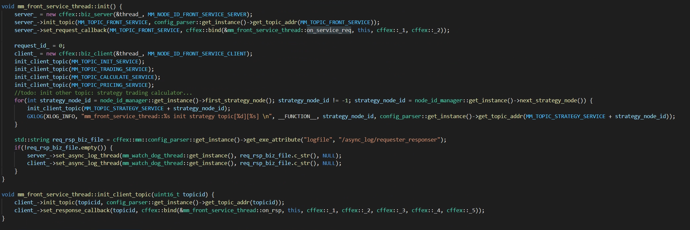
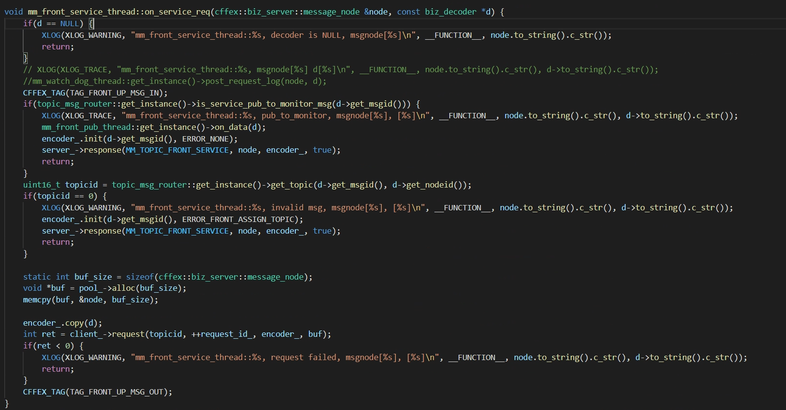
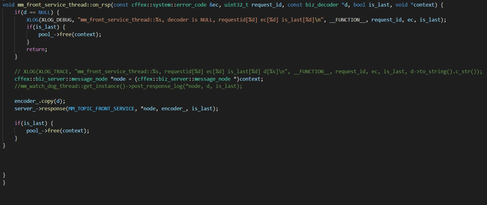

on_service_req

在server处得到新的request, 将message_node,  decoder_(copy from decoder_)发往client

在client处得到response,client将context带出，供回调使用

context 是可以灵活定义的， request的时候存入，这里注意的是encoder_ 保存reqeust_id_的时机 ，后续得到的rsp 使用seq_no字段将原reqeust_id返回，在session中处理时，可以找到相应的context

